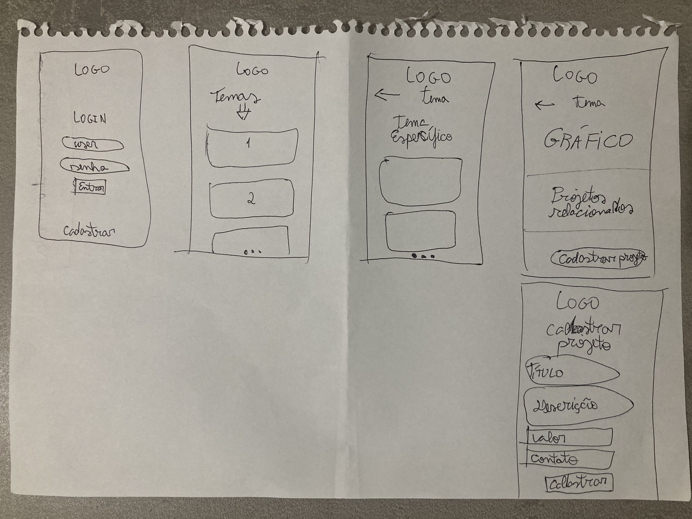
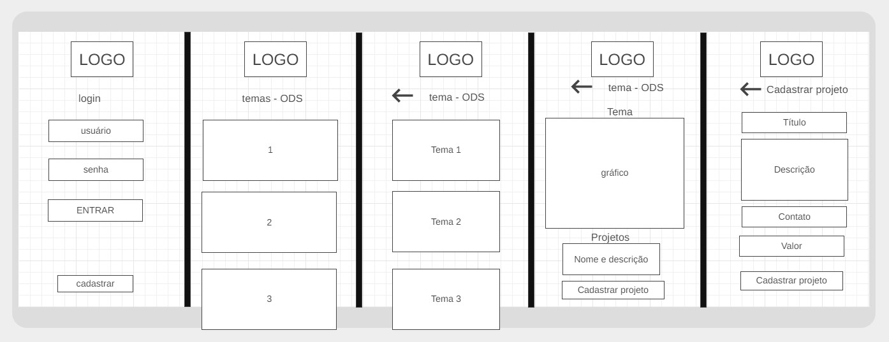

#  Hopee

Projeto de Proficiência de Fundamentos Web - CEFET/RJ

<a href="https://teste-proficiencia-2.vercel.app/" target="_blank">Link para o site!</a>

## Persona

Hopee foi criado com um único objetivo: fazer um match entre doadores/investidores e projetos sociais. Nossos usuários são pessoas interessadas em conhecer projetos sociais, possibilitando conectá-los diretamente. Os projetos são separados pelos <a href="https://brasil.un.org/pt-br/sdgs" target="_blank">Objetivos de Desenvolvimento Sustentável da ONU</a>. Em cada ODS existem diversos temas, para facilitar a busca dos projetos. E em cada tema é possível visualizar informações e dados acerca do mesmo, além de ver os projetos que estão cadastrados! Nossos usuários também são representantes de projetos sociais; podendo cadastrar suas organizações, conhecer outros projetos, fazer parcerias, ... são inúmeras oportunidades!

Exemplo: Alice tem 31 anos, e quer ajudar projetos que incentivam a educação sobre a tecnologia Blockchain para comunidades carentes.

Já por outro lado, Bob, de 22 anos, acabou de cadastrar na Hopee o seu projeto social, Chainducation, que é sobre dar aulas de programação Blockchain para moradores de comunidades.

Alice entra na Hopee e... match! Agora vai ser possível a Alice conhecer mais sobre o projeto do Bob e ajudar, seja financeiramente, divulgando ou trabalhando voluntariamente!

## Wireframes

- <strong>V1</strong>

 

- <strong>V2</strong>

## Fluxo de navegação de telas

- <a href="https://www.figma.com/file/e5o8s8qk3Jx99suExFQrmk/Projeto-Profici%C3%AAncia?node-id=0%3A1" target="_blank">Link para o Figma</a>

## Acessibilidade

Todo o projeto está com acessibilidade nota máxima, segundo os sites:

- <a href="https://accessmonitor.acessibilidade.gov.pt/" target="_blank">Access Monitor</a>

- <a href="https://www.webaccessibility.com/" target="_blank">Web Accessibility</a>

- <a href="https://web.dev/measure/" target="_blank">web.dev</a>

## Tecnologias utilizadas

- JavaScript

- TypeScript

- React

- NextJS

NextJS é um Framework React! Escolhi utilizá-lo por já estar acostumado com ele, além de oferecer muitas facilidades no processo de desenvolvimento. Utilizei como linguagem principal o TypeScript, e optei utilizar o JavaScript apenas para trabalhar com as API's e com os gráficos dinâmicos.

- TailwindCSS

TailwindCSS é um Framework CSS! O Tailwind permite fazer a estilização diretamente no HTML, aumentando muito a produtividade na hora de programar. Sempre opto pelo Tailwind, é muito bom! 

- ChartJS

ChartJS foi incluído para auxiliar a criação dos gráficos dinâmicos, que são abastecidos por API's externas e internas.

- Flat Icon

- Figma

- Wireframe.cc

Para design e ícones.

- Vercel

Para colocar o site no ar.

## Observações

- 1

Foram feitas apenas as ODS's #3, #4 e #15 para esta primeira entrega.

- 2

Os gráficos dinâmicos das ODS's #3, #4 e #15 estão funcionando normalmente. Os gráficos da #4 e da #15 estão recebendo dados de API's externas. Para o gráfico da ODS #3, eu criei uma API para interagir com a API externa, por causa de um problema de autorização de acesso da mesma.

- 3

Existe um erro de segurança nos formulários do Login e de Cadastrar um projeto. Como se trata de informações sensíveis (senhas e contatos), o ideal seria utilizar o <code>method='post'</code>, porém seria necessário um lado servidor para receber os dados. Pelo requisitos deste projeto, e por ser apenas um MVP, não vi necessidade de utilizar o <code>method='post'</code> nesse momento. Ao invés disso, utilizei o <code>method='get'</code>, e o problema é que a URL recebe as informações colocadas no formulário.