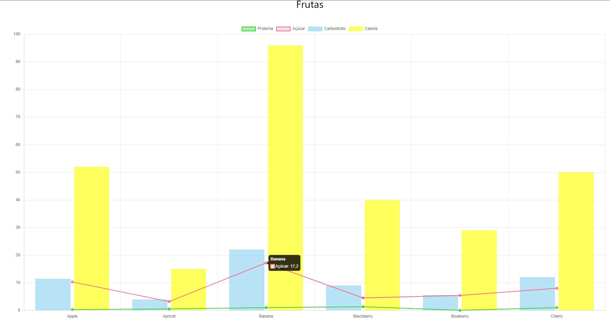

# Hopee

Projeto de Proficiência de Fundamentos Web - CEFET/RJ

## Tecnologias utilizadas

Falar as tecnologias (frameworks, libs, linguagens,...) e explicar pq eu usei cada uma delas.

## Persona

Descrever a persona do site

## Wireframes

- <strong>V1</strong>

 

- <strong>V2</strong>

## Fluxo de navegação de telas

Figma e talvez um pdf ou imagem mostrando só as setas para cada tela (depois do Figma)

## Acessibilidade

Todo o projeto está com acessibilidade nota 10, segundo os sites:
- [Access Monitor](https://accessmonitor.acessibilidade.gov.pt/)
- [Web Accessibility](https://www.webaccessibility.com/)

## Observações

- 1

Foram feitas apenas as ODS's #3, #4 e #15 para esta primeira entrega.

 

- 2

 

Os gráficos dinâmicos das ODS's #4 e #15 estão funcionando normalmente, recebendo dados de API's externas para alimentar os gráficos. O gráfico da ODS #3 não está recebendo os dados da API, por causa de um problema de autorização de acesso da mesma. Eu criei uma API para interagir com a API externa, porém esta API funciona apenas no Localhost! Segue foto do gráfico com dados:

 

 

- 3

 

Existe um erro de segurança nos formulários do Login e de Cadastrar um projeto. Como se trata de informações sensíveis (senhas e contatos), o ideal seria utilizar o <code>method='post'</code>, porém seria necessário um lado servidor para receber os dados. Pelo requisitos deste projeto, e por ser apenas um MVP, não vi necessidade de utilizar o <code>method='post'</code> nesse momento. Ao invés disso, utilizei o <code>method='get'</code>, e o problema é que a URL recebe as informações colocadas no formulário.

 